<div align="center">


<p align="center">
  
</p>

<p align="center">
  <a href="#-features"></a>
  <a href="#-demo"></a>
  <a href="#-installation"></a>
  <a href="#-tech-stack"></a>
</p>

<p align="center">
  
  
  
  
  
</p>

<p align="center">
  
  
  
</p>

<h3>🚀 Deploy Machine Learning Models with Just a Click! 🚀</h3>

<p>
A production-ready full-stack web application that makes deploying AI models as simple as uploading a file. Built with modern technologies and powered by state-of-the-art models from Hugging Face.
</p>


</div>

---

## 📸 Application Screenshot

<div align="center">
  
  <p><i>✨ Beautiful, modern, and responsive user interface ✨</i></p>
</div>

---

## 🌟 Why This Project Stands Out

<table>
<tr>
<td width="50%">

### 🎯 **Real AI Models**
- Not dummy predictions!
- State-of-the-art Transformers
- 89M - 125M parameter models
- Production-grade accuracy

</td>
<td width="50%">

### ⚡ **Modern Tech Stack**
- React 18 with Hooks
- FastAPI async endpoints
- Beautiful Tailwind CSS
- RESTful API design

</td>
</tr>
<tr>
<td width="50%">

### 🎨 **Professional UI/UX**
- Gradient hero sections
- Smooth animations
- Responsive design
- Interactive visualizations

</td>
<td width="50%">

### 🚀 **Production Ready**
- Error handling
- CORS enabled
- Auto API docs
- File validation

</td>
</tr>
</table>

---

## ✨ Features

<div align="center">

| 🤖 Model | 📊 Description | 🎯 Accuracy | 💾 Size |
|:--------:|:--------------|:-----------:|:-------:|
| **Text Classification** | Sentiment analysis using DistilBERT | ~91% | 268MB |
| **Sentiment Analysis** | 3-class classification with RoBERTa | SOTA | 990MB |
| **Image Captioning** | Generate captions using BLIP | High | 990MB |

</div>

### 🎨 **User Experience**
```
┌─────────────────────────────────────────────────────────────┐
│  ✨ Upload CSV/Image → 🤖 AI Processing → 📊 Beautiful Results  │
└─────────────────────────────────────────────────────────────┘
```

<details>
<summary>🎯 <b>Click to see all features</b></summary>

- ✅ **Drag & Drop File Upload** - Intuitive file selection
- ✅ **Real-Time Predictions** - Instant AI-powered results
- ✅ **Interactive Dashboard** - Beautiful data visualization
- ✅ **Summary Statistics** - Quick insights at a glance
- ✅ **Confidence Scores** - See how confident the AI is
- ✅ **Export Results** - Download predictions as JSON
- ✅ **Responsive Design** - Works on all devices
- ✅ **REST API** - Use programmatically via API
- ✅ **Auto Documentation** - Interactive API docs at /docs
- ✅ **Error Handling** - Clear, helpful error messages

</details>

---

## 🎬 Demo

<div align="center">

### 🏠 Home Page
*Stunning landing page with gradient hero section*


### 📊 Dashboard
*Upload files, select models, get instant predictions*

### 📈 Results
*Beautiful tables with summary statistics*

</div>

---

## 🏗️ Architecture

```mermaid
graph TB
    A[🌐 User Browser] -->|HTTP Request| B[⚛️ React Frontend]
    B -->|axios POST| C[🚀 FastAPI Backend]
    C -->|Process| D[🤖 AI Models]
    D -->|Predictions| C
    C -->|JSON Response| B
    B -->|Display| A
    
    style A fill:#61DAFB
    style B fill:#20232A
    style C fill:#009688
    style D fill:#FF6B6B
```

<div align="center">


</div>

<div align="center">

### 🔄 Data Flow
```
User Upload → Frontend Validation → Backend API → 
AI Model Processing → JSON Response → Beautiful UI Display
```

</div>

---

## 🚀 Quick Start

<details open>
<summary>📦 <b>Installation Steps</b></summary>

### Prerequisites
```bash
✅ Python 3.8+
✅ Node.js 16+
✅ npm or yarn
✅ 4GB+ RAM
```

### 1️⃣ Clone Repository
```bash
git clone https://github.com/swarajshinde12/full_stack_ai_dashboard.git
cd full_stack_ai_dashboard
```

### 2️⃣ Backend Setup
```bash
cd backend

# Create virtual environment
python -m venv venv

# Activate (Windows)
venv\Scripts\activate
# Activate (Mac/Linux)
source venv/bin/activate

# Install dependencies
pip install -r requirements.txt
```

### 3️⃣ Frontend Setup
```bash
cd ../frontend

# Install dependencies
npm install
```

### 4️⃣ Run the Application

**Terminal 1 - Backend:**
```bash
cd backend
python main.py
```
> 🚀 Backend: http://localhost:8000  
> 📚 API Docs: http://localhost:8000/docs

**Terminal 2 - Frontend:**
```bash
cd frontend
npm start
```
> 🎨 Frontend: http://localhost:3000

</details>

---

## 🛠️ Tech Stack

<div align="center">

### Frontend Technologies


| Technology | Purpose | Version |
|:----------:|:--------|:-------:|
| ⚛️ **React** | UI Framework | 18.x |
| 📡 **Axios** | HTTP Client | Latest |
| 🎨 **CSS3** | Styling | - |
| 🧭 **React Router** | Navigation | 6.x |

### Backend Technologies


| Technology | Purpose | Version |
|:----------:|:--------|:-------:|
| 🚀 **FastAPI** | Web Framework | 0.115+ |
| 🐍 **Python** | Language | 3.8+ |
| 🤗 **Transformers** | AI Models | 4.48+ |
| 🔥 **PyTorch** | Deep Learning | 2.6+ |
| 🐼 **Pandas** | Data Processing | 2.2+ |

### AI Models

| Model | Architecture | Parameters | Use Case |
|:-----:|:------------|:----------:|:---------|
| 📊 **DistilBERT** | Transformer (distilled) | 89M | Text Classification |
| 💬 **RoBERTa** | Transformer (optimized) | 125M | Sentiment Analysis |
| 🖼️ **BLIP** | Vision-Language | Large | Image Captioning |

</div>

---

## 📁 Project Structure
```
full_stack_ai_dashboard/
│
├── 🎨 frontend/
│   ├── src/
│   │   ├── App.js                 # Main component
│   │   ├── App.css               # Global styles
│   │   ├── pages/
│   │   │   ├── Home.js           # Landing page
│   │   │   └── Dashboard.js      # Main dashboard
│   │   └── index.js              # Entry point
│   ├── public/
│   └── package.json
│
├── 🚀 backend/
│   ├── main.py                   # FastAPI application
│   ├── requirements.txt          # Dependencies
│   └── venv/                     # Virtual environment
│
├── 📸 ss.png                     # Screenshot
├── 📝 README.md                  # This file
├── 🚫 .gitignore
└── 📄 LICENSE
```

---

## 🎯 API Endpoints

<div align="center">

| Method | Endpoint | Description | Input | Output |
|:------:|:---------|:------------|:------|:-------|
| `GET` | `/` | API Information | - | JSON |
| `GET` | `/health` | Health Check | - | Status |
| `GET` | `/api/models` | List Models | - | Model Info |
| `POST` | `/api/predict/text-classification` | Text Classification | CSV | Predictions |
| `POST` | `/api/predict/sentiment-analysis` | Sentiment Analysis | CSV | Sentiments |
| `POST` | `/api/predict/image-caption` | Image Captioning | Image | Caption |

</div>

### 📚 Interactive API Documentation

Visit `http://localhost:8000/docs` for:
- ✅ Try out API endpoints directly
- ✅ See request/response schemas
- ✅ Download OpenAPI specification
- ✅ Test with your own files

---

## 💡 Usage Examples

<details>
<summary>📊 <b>Text Classification Example</b></summary>

**Input CSV:**
```csv
text
This product is absolutely amazing! Best purchase ever!
Terrible quality. Very disappointed.
It's okay, nothing special.
Highly recommend! Great value for money!
Worst experience ever. Complete waste.
```

**API Response:**
```json
{
  "success": true,
  "model": "text-classification",
  "model_name": "DistilBERT (Real AI Model)",
  "total_predictions": 5,
  "summary": {
    "positive": 2,
    "negative": 3
  },
  "predictions": [
    {
      "id": 1,
      "text": "This product is absolutely amazing!...",
      "prediction": "positive",
      "confidence": 0.9998
    },
    ...
  ]
}
```

</details>

<details>
<summary>💬 <b>Sentiment Analysis Example</b></summary>

**Results include 3 classes:**
- 😊 Positive
- 😐 Neutral  
- 😞 Negative

With confidence scores and summary statistics!

</details>

<details>
<summary>🖼️ <b>Image Captioning Example</b></summary>

**Upload any image and get:**
```json
{
  "success": true,
  "model": "image-caption",
  "filename": "dog.jpg",
  "caption": "a dog sitting on a couch in a living room",
  "confidence": 0.95
}
```

Works with photos of:
- 🐕 Animals
- 🌅 Landscapes
- 🚗 Objects
- 👤 People
- 🏙️ Cities
- And more!

</details>

---

## 🎨 Screenshots

<div align="center">

### 🏠 Landing Page


### 📊 Model Selection
*Three powerful AI models to choose from*

### 📈 Results Visualization
*Beautiful tables with statistics and insights*

</div>

---

## 🚀 Deployment Guide

<details>
<summary>☁️ <b>Deploy to Production</b></summary>

### Backend Deployment

**Option 1: Railway (Recommended)**
```bash
# Install Railway CLI
npm install -g @railway/cli

# Login
railway login

# Deploy
railway up
```

**Option 2: Render**
1. Push to GitHub
2. Connect Render to repo
3. Deploy as Web Service

### Frontend Deployment

**Vercel (Recommended)**
```bash
# Install Vercel CLI
npm install -g vercel

# Deploy
cd frontend
vercel
```

**Netlify**
```bash
cd frontend
npm run build
# Drag & drop build/ folder to Netlify
```

</details>

---

## 🤝 Contributing

<div align="center">

Contributions make the open-source community amazing! Any contributions are **greatly appreciated**.


</div>

### How to Contribute

1. 🍴 Fork the Project
2. 🌿 Create Feature Branch (`git checkout -b feature/AmazingFeature`)
3. ✅ Commit Changes (`git commit -m 'Add AmazingFeature'`)
4. 📤 Push to Branch (`git push origin feature/AmazingFeature`)
5. 🎉 Open Pull Request

---

## 📊 Project Stats

<div align="center">


</div>

---

## 📜 License

<div align="center">

This project is licensed under the **MIT License** - see the [LICENSE](LICENSE) file for details.


</div>

---

## 👨‍💻 Author

<div align="center">


<p>
  <a href="https://linkedin.com/in/swaraj-shinde-3b8631223">
    
  </a>
  <a href="https://github.com/swarajshinde12">
    
  </a>
  <a href="mailto:your.email@example.com">
    
  </a>
</p>

</div>

---

## 🙏 Acknowledgments

<div align="center">

Special thanks to these amazing projects and organizations:

<table>
<tr>
<td align="center">
  <br/>
  <b>Hugging Face</b><br/>
  <sub>Pre-trained Models</sub>
</td>
<td align="center">
  <br/>
  <b>FastAPI</b><br/>
  <sub>Web Framework</sub>
</td>
<td align="center">
  <br/>
  <b>React</b><br/>
  <sub>UI Library</sub>
</td>
<td align="center">
  <br/>
  <b>Python</b><br/>
  <sub>Programming Language</sub>
</td>
</tr>
</table>

</div>

---

## 🌟 Show Your Support

<div align="center">

<h3>If you found this project helpful, please ⭐ star this repository!</h3>


<br/><br/>


<br/><br/>


</div>
